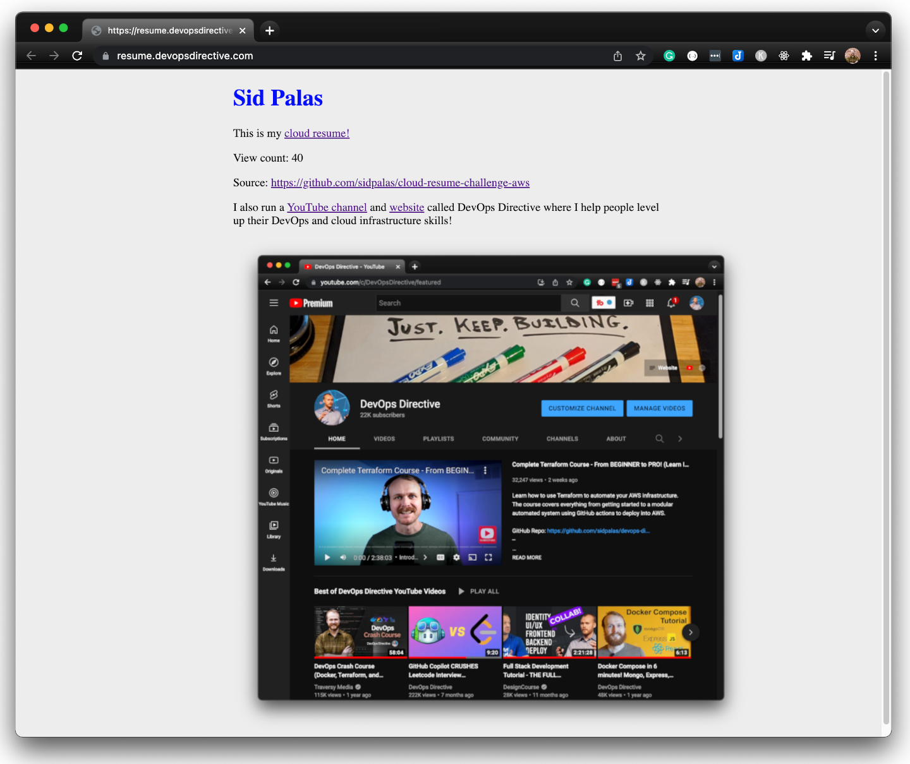

# Cloud Resume Challenge (AWS, Cloudflare, Pulumi)

This repo represents my implementation of the [Cloud Resume Challenge](https://cloudresumechallenge.dev/docs/the-challenge/aws/)!

|  |
|:--:|
| <i>Sorry it doesn't look like much! </i>😅|

I mostly followed the AWS path, with a few minor tweaks:
- CloudFlare for DNS instead of Route53
- Pulumi for IaC instead of AWS Serverless Application Model

## Repo Layout

### Client

- Minimal html, js, and css files
- Deployed to S3 bucket fronted by Cloudfront CDN

### Server

- DynamoDB table uses an `environment` key with a `view_count` value
- Python AWS Lambda function defines a single API route handler which increments the view count for the relevant environment and returns that incremented value.
- Deployed via AWS Lambda + API Gateway

### Pulumi

- Infrastructure as code configuration for all resources:
  - `s3.py` - Bucket to store client files
  - `s3_objects.py` - Client files
  - `dynamodb.py` - Database to persist `view_count`
  - `lambda_fn.py` - Serverless api handler
  - `api_gateway.py` - HTTP API routing to Lambda
  - `dns.py` - Cloudflare DNS records to set up custom domain
  - `cloudfront.py` - CDN definition

## Challenges:
- Pulumi doesn't wait for the SSL certificate to be issued, but it must be active before using it in the API gateway and Cloudfront distribution
- The Pulumi AWS provider does not support adding cache invalidations for cloudfront distributions so I ended up using the `pulumi-command` package to call out to the AWS CLI

## TODO: 
- Execute python tests in github action workflow
- Add separate dev/staging/production Pulumi stacks
